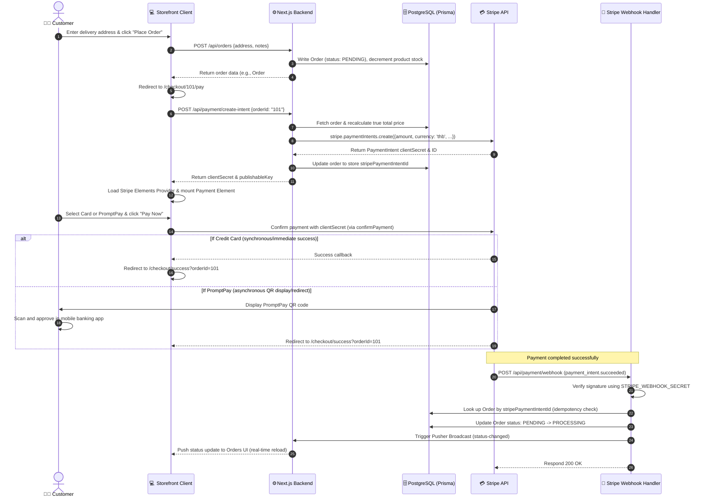

# 💳 Stripe Payment Flow Overview — The Crumbs

To build a robust payment system supporting **Credit Cards** and **PromptPay**, we utilize Stripe's **Payment Intents API** combined with **Stripe Elements** (specifically the **Payment Element**).

This document explains the conceptual flow, lifecycle, and security model of how Stripe interacts with our Next.js backend and client storefront.

---

## 🔄 End-to-End Sequence Diagram

The following diagram illustrates how the checkout flow proceeds from order creation to payment authorization and database updates via Stripe Webhooks:

---

## 🛠️ How Stripe Works: Key Concepts

### 1. The PaymentIntent
A **PaymentIntent** is a Stripe object created on the server that represents your intent to collect a payment from a customer. It tracks the payment lifecycle from initiation to success:
* **Amount**: Set in the smallest currency unit. In Thai Baht (THB), this is the **Satang** (e.g., ฿25.50 must be represented as `2550`).
* **Metadata**: We store `{ orderId: order.id }` in the PaymentIntent. This allows our webhook handler to identify which order was paid without having to ask the client.
* **Client Secret**: A secure key returned to the frontend. It allows Stripe Elements to mount the payment interface and collect details securely without exposing your main secret key.

### 2. Stripe Elements & Payment Element
**Stripe Elements** are pre-built UI components. The **Payment Element** is a unified component that displays payment methods dynamically:
* In Thailand, enabling `automatic_payment_methods: { enabled: true }` in the PaymentIntent will display **Credit/Debit Cards** and **PromptPay** side-by-side depending on what you configured in the Stripe Dashboard.
* Stripe hosts the sensitive fields (like card numbers), keeping your servers entirely out of PCI compliance scope.

### 3. Webhooks & Asynchronous Processing
* **Why do we need webhooks?** For payment methods like PromptPay, the customer must open their banking app, scan a QR code, and complete the transfer. This takes time (seconds or minutes). The customer might also close the checkout tab.
* **How it works:** Once the customer transfers the money, Stripe's bank detects the payment and fires an HTTP POST request (webhook) to `/api/payment/webhook`.
* **Idempotency:** Webhooks may be retried by Stripe if they fail to receive a timely response. Our code must check the database first: if the order is already marked as `PROCESSING`, we ignore the webhook event to avoid double-processing (e.g., sending multiple Pusher chimes or updating stock twice).

### 4. Webhook Signature Verification
To prevent malicious actors from spoofing payment success events, Stripe signs every webhook payload.
* We read the raw request payload (as text, not JSON) and the `stripe-signature` header.
* We verify it using our server-side `STRIPE_WEBHOOK_SECRET` and Stripe SDK's verification library. If signature verification fails, we reject the request immediately with a `400` code.
